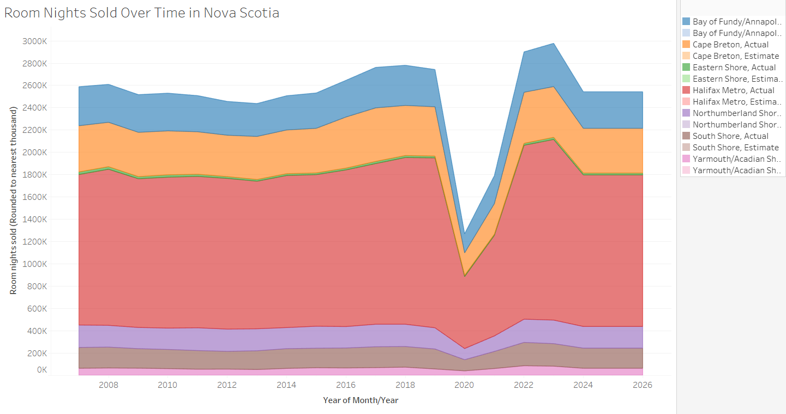
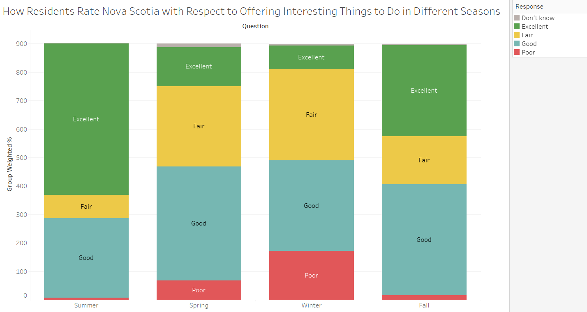
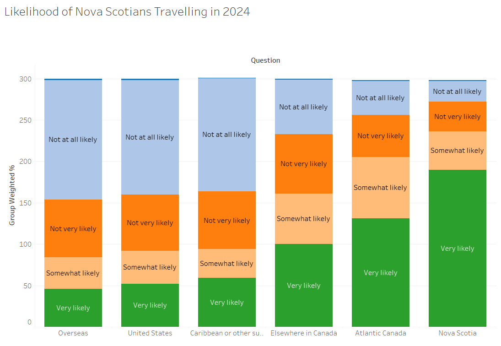
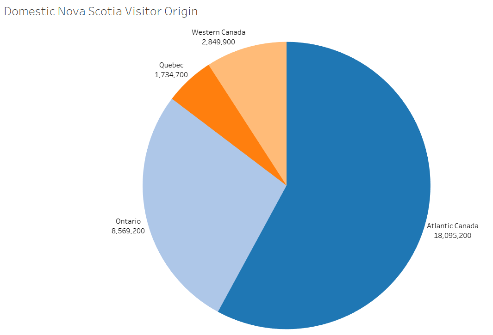
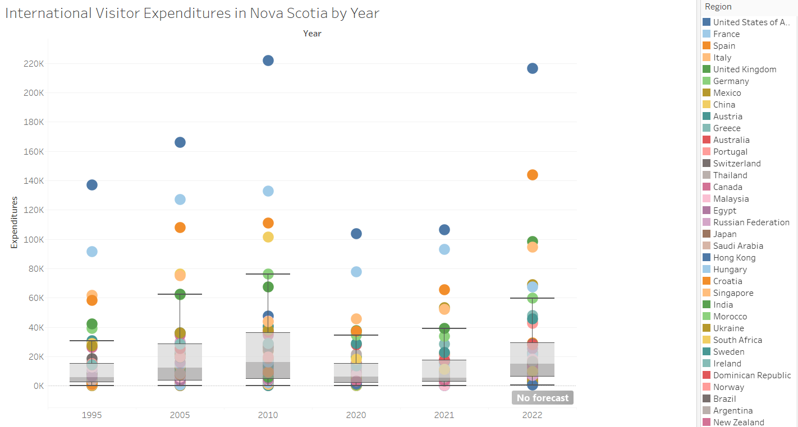

**Data Cleaning Steps:**

1. **Room Nights Sold Over Time in Nova Scotia**
- Added cleaning step
- Removed Occupancy Rate (all values equaled 0, not helpful data)
- Changed Month/Year data type from String to Date
- Changed Region data role to Geographic (County)
- Ran Output
  

2. **Nova_Scotians_Engagement**
- Added cleaning step
- Changed Year data type to Date
- Changed Group Weighted % data type from Number (whole) to Number (decimal)
- Changed Table column name to Question
- Ran Output
  

3. **Tourism Nova Scotia Visitation**
- Clean step
- Changed Month/Year data type from String to Date
- Grouped duplicates from visitor origin and country
- Ran Output
  

4. **Arrival and Expenditures**
- Clean step
- Removed null field
- Changed Data role to country/region
- Grouped invalid values with matching values from the data role
- Filtered rows with invalid values for the data role
- Changed t31 column to "Tourist arrival and expenditures"
- Changed "Tourist arrival and expenditures" to Region
- Changed F3 to Year
- Changed Year data role to date
- Excluded Series value in F4
- Deleted F5 column
- Deleted F9 column
- Changed first column name to Expenditures
- Changed F7 column name to Arrivals
- Deleted F4
- Sorted columns
- Ran output
  

