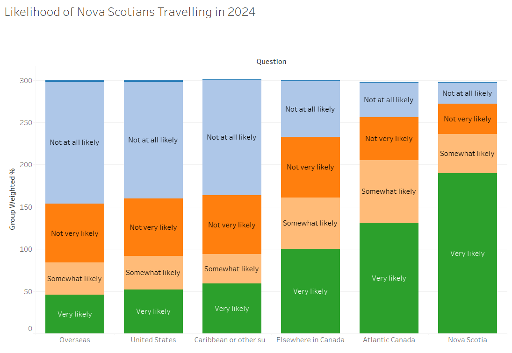
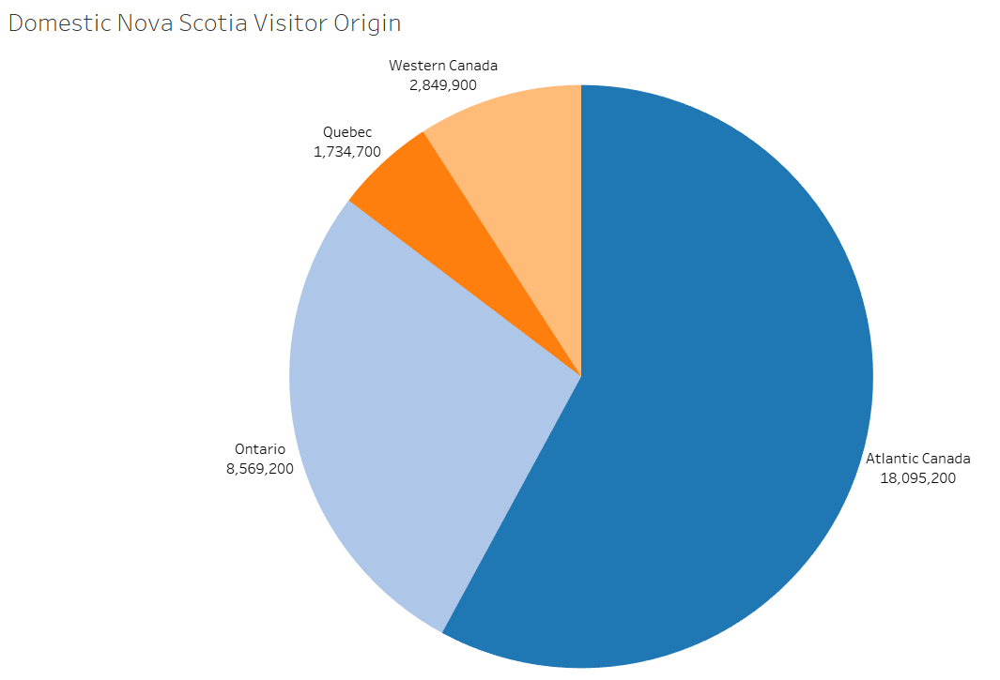
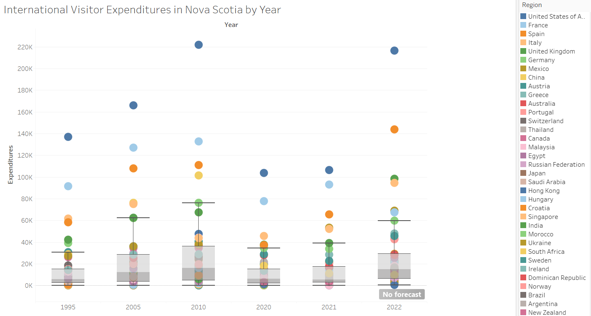

## 1. Room Nights Sold Over Time in Nova Scotia

**Interpretation:** The graph shows the number of room nights sold in Nova Scotia over time, broken down by different regions. From 2008 to 2019, the number of room nights sold remained fairly steady. In 2020, there was a sharp drop, likely due to the COVID-19 pandemic. After 2021, the numbers quickly increased again and even peaked higher than before. More recently, the numbers have leveled off but remain strong. The Halifax Metro area and Cape Breton seem to make up a big part of the total room nights sold. This chart helps show how tourism and accommodations in Nova Scotia have changed over time, especially during and after the pandemic.

## 2. How Residents of Nova Scotia Rate Seasons

**Interpretation:** The chart shows how residents rate Nova Scotia in terms of offering interesting things to do in different seasons. Summer has the highest rating, with most people rating it as "Excellent" or "Good." Spring, Fall, and Winter have more mixed ratings, with fewer people giving them an "Excellent" rating. Winter has the most "Poor" ratings, meaning many residents feel there are fewer interesting activities during this season. Overall, Nova Scotia is seen as having the most to offer in the summer, while the colder seasons receive more average or negative ratings.

## 3. Likelihood of Nova Scotians Travelling In 2024

**Interpretation:** The bar chart shows how likely Nova Scotians are to travel in 2024 to different places. Most people are not likely to travel overseas, to the United States, or to the Caribbean, with "Not at all likely" being the largest group for those destinations. More people are considering traveling within Canada, especially in Atlantic Canada and Nova Scotia. A large number of people are "Very likely" to travel within Nova Scotia, meaning they prefer to stay closer to home rather than travel far.

## 4. Domestic Nova Scotia Visitor Origin

**Interpretation:** The pie chart shows where visitors to Nova Scotia come from within Canada. Most visitors are from Atlantic Canada, making up the largest portion. Ontario is the second biggest source of visitors, followed by Western Canada and then Quebec. This means that people from nearby provinces visit Nova Scotia the most, while fewer visitors come from farther parts of the country.

## 5. Nova Scotia Arrivals and Expenditures

**Interpretation:** The chart shows how much money international visitors spent in Nova Scotia over different years. Each dot represents a country, and the higher the dot, the more money visitors from that country spent. The box plots show the overall spending patterns for each year. The United States stands out as the biggest spender, with much higher amounts compared to other countries. Spending changes over time, with some years seeing bigger amounts, like around 2010 and 2022. The drop in 2020 and 2021 suggests the impact of the COVID-19 pandemic, but spending seems to rise again in 2022. Many different countries continue to visit Nova Scotia, showing that it remains a popular travel destination.
