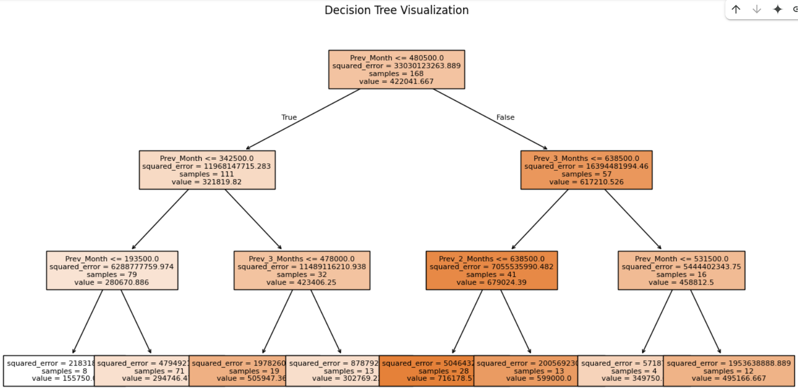
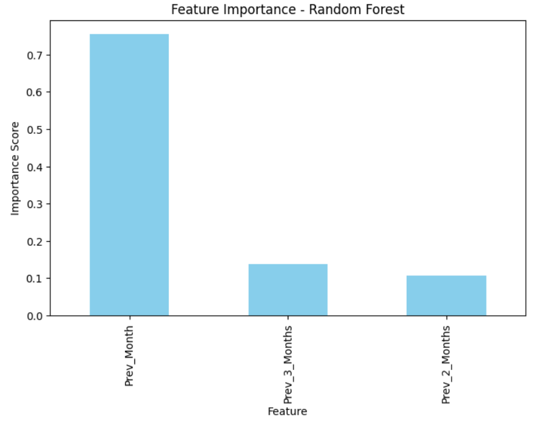
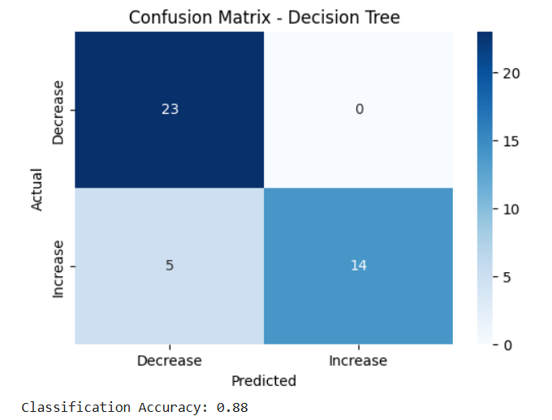

## Model Explanation
This model is designed to predict the number of hotel room nights sold using past sales data. The dataset includes monthly room night sales, and additional features are created to incorporate past sales from the previous one, two, and three months. These historical values help the model recognize patterns and trends over time. A Decision Tree Regressor is trained to analyze these patterns and make future predictions. Additionally, a Random Forest Regressor is used as a comparison to enhance accuracy by combining multiple decision trees. The model's performance is evaluated using Root Mean Squared Error (RMSE) and Mean Absolute Error (MAE) to measure how closely the predictions align with actual sales. The decision tree is visualized to understand its decision-making process, and feature importance analysis highlights which past sales values influence the predictions the most. A classification task is included to predict whether sales will increase or decrease, with a confusion matrix and accuracy score used to measure its effectiveness.
## Results

1. **Decision Tree Visualization**  

   

2. **Feature Importance - Random Forest**  

   

3. **Confusion Matrix Decision Tree**  

   
